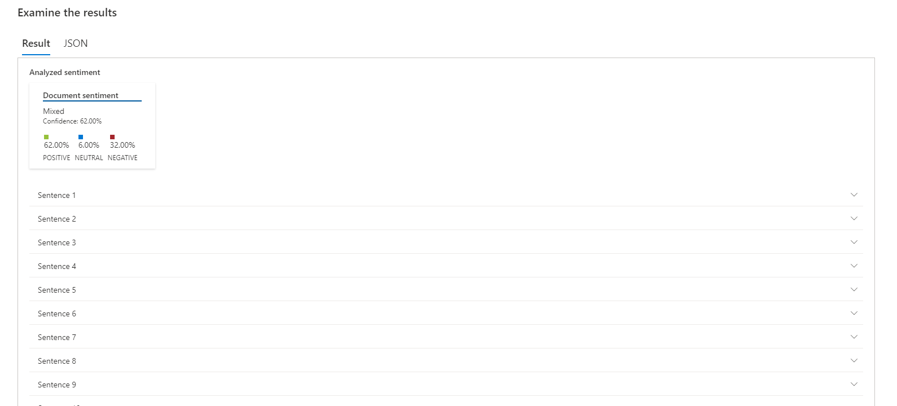

# Análise de Sentimentos

Para o projeto eu utilizei o poema de Vinicius de Morais, Soneto da Rosa Tardia, de 1957.

Como resultado foi possivel encontrar 62% de positividade, 6% de neutralidade e 32% de negatividade.

