# Desafio Machine Learning

Documentação do desafio: [Link](https://microsoftlearning.github.io/mslearn-ai-fundamentals/Instructions/Labs/01-machine-learning.html).

1. Ingressar no [Portal Azure](https://github.com/eudeslimaar/dio-lab-ai-900.git "portal da azure") depois de criar a conta.
2. Selecionar criar um novo recurso.
3. Na parte de buscas, procurar por "Azure Machine Learning" e selecionar "criar".
4. Configurar Workspace do ML(Machine Learning) criando um grupo de recursos e definindo um nome ao experimento.

   
5. Ao finalizar as configurações, selecionar" revisar +  criar" e verificar se esta tudo correto.
6. Aguardar a implantação.
7. Depois de finalizada selecinoar "Iniciar o estúdio".
8. Dentro do [estúdio](https://ml.azure.com/ "Estúdio da Azure"), selecionar "ML Automatizado" na barra lateral esquerda.
9. Em método de treinamento predefinido esta para treinar automaticamente.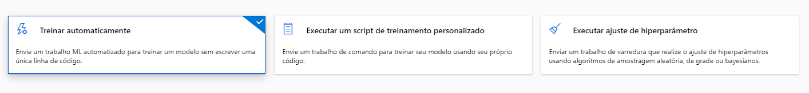
10. Em configurações básicas, preencher o formulario com nome desejado.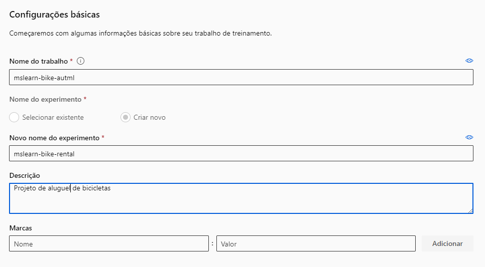
11. Em "Tipo de tarefas", selecionar "regressão" e em seguida clicar em "Criar".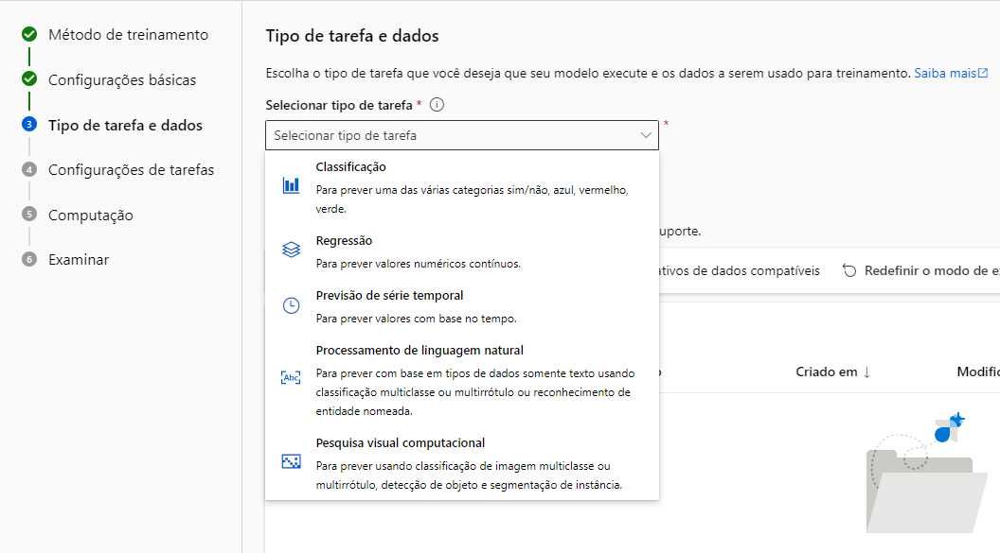
12. Definir o nome como desejar e o tipo do ativo de dados como "Tabular."
13. Em "Fonte de dados" selecionamos arquivos da web.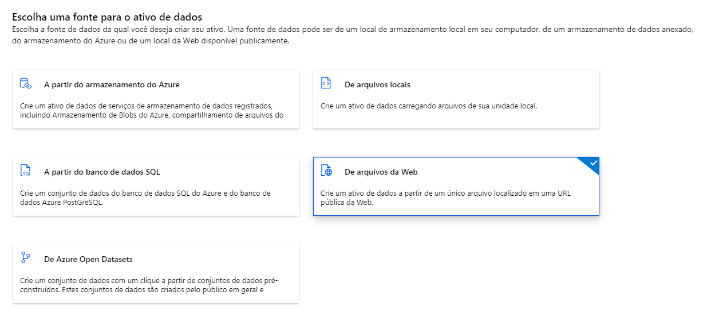
14. "En URL da Web" usaremos a seguinte URL: [Link.](https://aka.ms/bike-rentals "CSV bike-rentals")
15. Fazer as configurações de imagem abaixo e aguardar o pre-carragamento.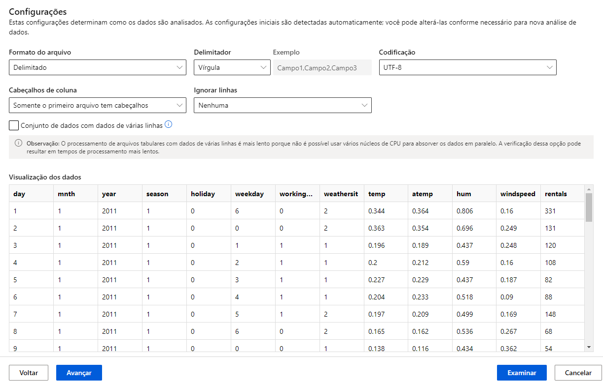
16. Verificar se o tipo de valor corresponde aos campos detectados.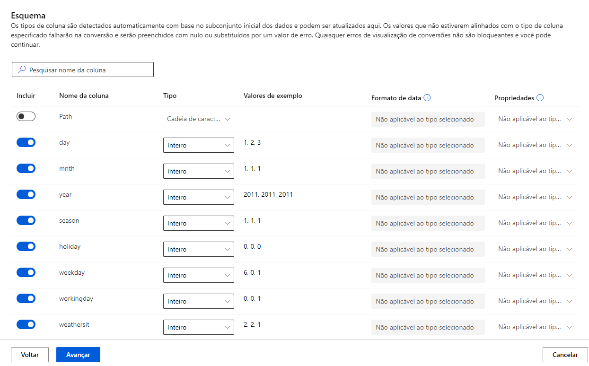
17. Examinar e confirmar se esta tudo ok.
18. Selecionar o tipo de tarefa e clicar em "avançar".
19. Selecionar "exibir definições de configuração adicionais" e colocar as configurações da imagem abaixo.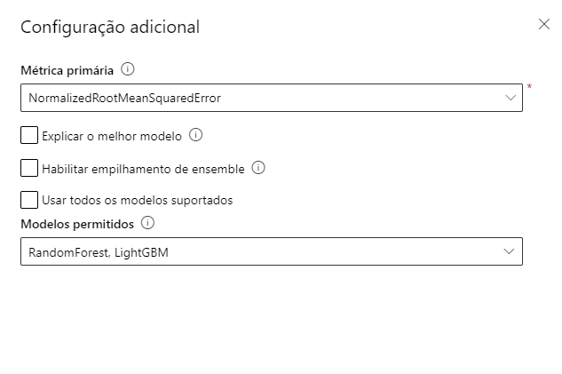
20. em Limites colocar: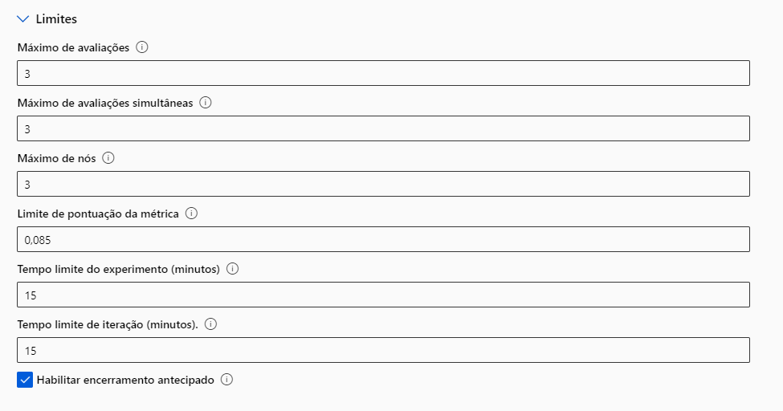
21. Em validar e testar, selecionar esta configuração: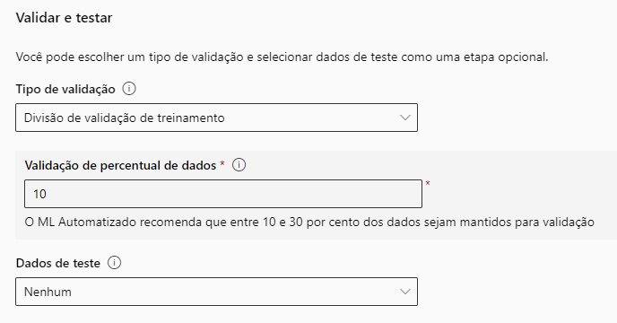
22. Em Computação deixar a configuração padrão.
23. Revisar as configurações e selecionar "Enviar trabalho de treinamento".
24. Uma ver terminado selecionar o melhor modelo.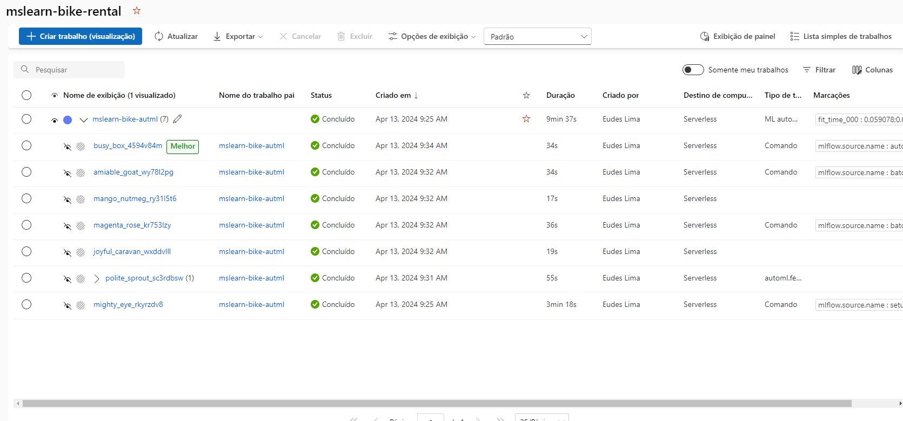
25. Depois de selecionar "metricas".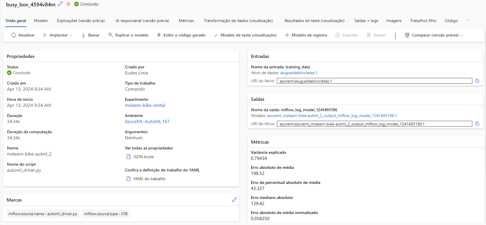
26. Marcar somente "residuals" e "predicted_true".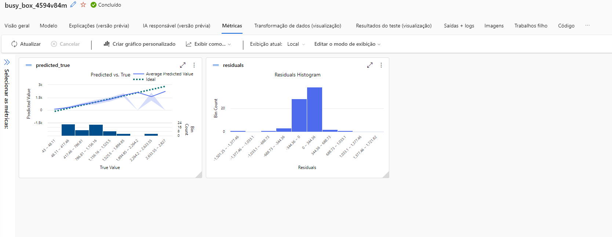
27. 
28. Realizar as configuracoes abaixo e selecionar implantar.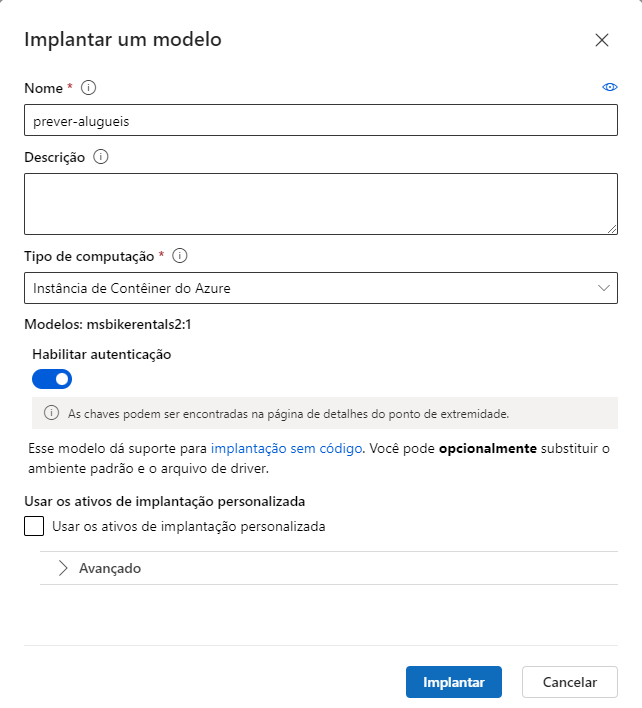
29. Selecionar "ponto de extremidade" na aba lateral depois que o deploy/impletação seja finalizada com exito.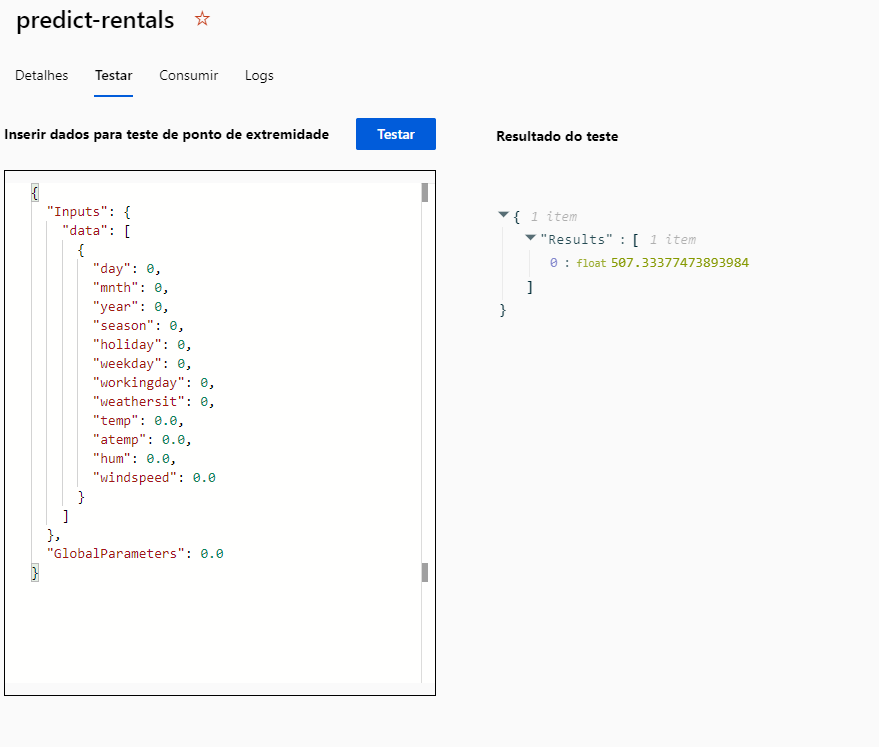
30. Usar o codigo presente na [documentação](https://microsoftlearning.github.io/mslearn-ai-fundamentals/Instructions/Labs/01-machine-learning.html) caso o codigo de prova não esteja disponivel.

```
{ 
    "Inputs": { 
      "data": [
        {
          "day": 1,
          "mnth": 1,   
          "year": 2022,
          "season": 2,
          "holiday": 0,
          "weekday": 1,
          "workingday": 1,
          "weathersit": 2, 
          "temp": 0.3, 
          "atemp": 0.3,
          "hum": 0.3,
          "windspeed": 0.3 
        }
      ]  
    },   
    "GlobalParameters": 1.0
  }
```

Resultado final:

```
{
  "Results": [
    507.33377473893984
  ]
}
```
