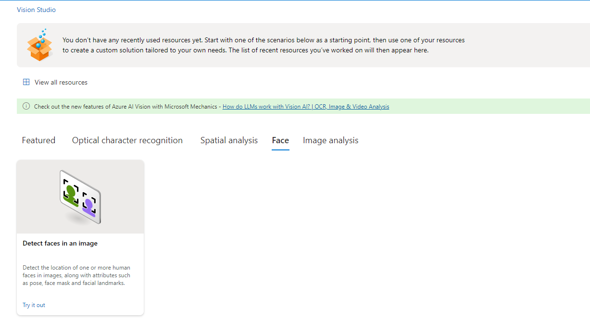
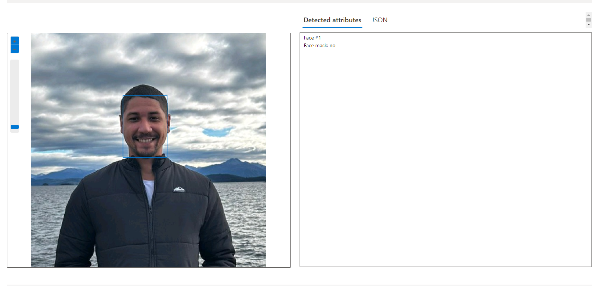
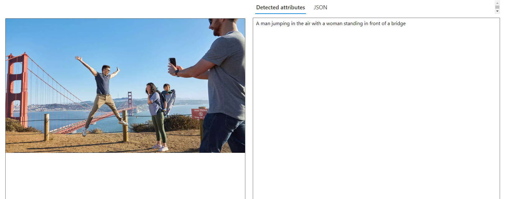
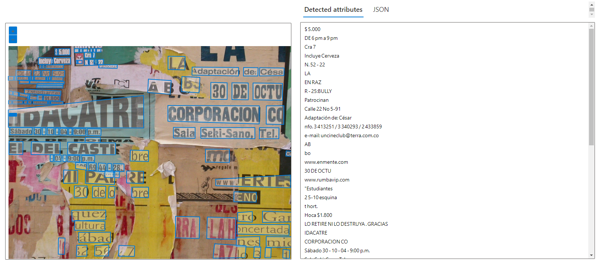

# Visão Computacional

## Links úteis

* [https://aka.ms/ai900-face](https://aka.ms/ai900-face)
* [https://aka.ms/ai900-ocr](https://aka.ms/ai900-ocr)
* [https://aka.ms/ai900-image-analysis](https://aka.ms/ai900-image-analysis)

1. Dentro do [portal cognitive](https://portal.vision.cognitive.azure.com/) escolher "Face"
2. carregar uma foto ou escolher as fotos disponiveis que devolve o reconhecimento ou un arquivo json.
3. Usando "Add caption to images"
4. Usando "Extract text from images"
