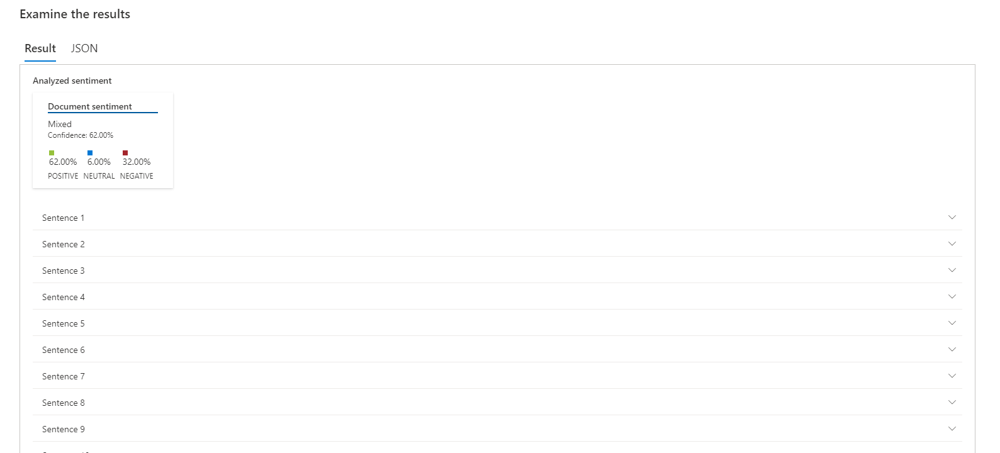

# Análise de Sentimentos com Language Studio

Links úteis:

* [https://aka.com/ai900-speech](https://aka.com/ai900-speech)
* [https://aka.com/ai900-text-analysis](https://aka.com/ai900-text-analysis)

Link para [Language Studio](https://language.microsoft.com/portal) portal.

Realizei uma analise de um antigo poema de Vinicio de Moraes, chamado "Soneto da rosa tardia".

Abaixo está o resultado:

